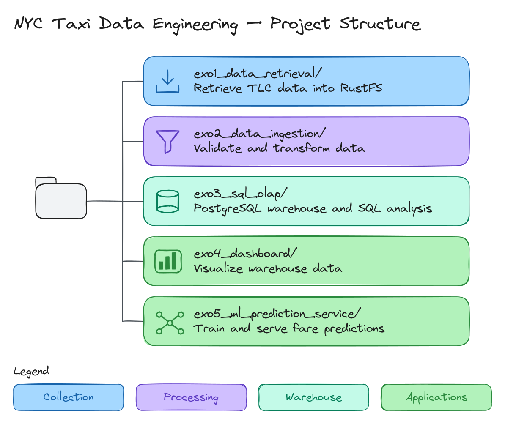

# NYC Taxi Data Engineering

A CY Tech Big Data coursework project using New York City taxi trip records.
The project covers data retrieval, ingestion and validation, SQL analytics,
a dashboard, and a fare prediction service.

## Current Status

The repository contains exercise scaffolding, Scala build definitions, and
Docker Compose configuration for RustFS and a Spark cluster. Application code
and tests have not been implemented yet. The end-to-end pipeline is not available.

## Project Structure



See the [assignment specification](docs/instructions/instructions.pdf) and
[course instructions](docs/instructions/README.md) for requirements and submission details.

## Data Source

The base dataset is the [NYC Taxi and Limousine Commission (TLC) Trip Record Data](https://www.nyc.gov/site/tlc/about/tlc-trip-record-data.page).
TLC publishes monthly Parquet files and provides data dictionaries and taxi zone
lookup tables on that page. The project will use yellow taxi trip records for
**May, June, and July 2026**.

## Setup

Install Docker with Docker Compose, sbt, and a Java JDK compatible with the
configured Spark version. Both Scala modules currently declare Scala **2.13.17**
and Apache Spark **4.2.0**.

From the repository root, start the infrastructure:

```bash
docker compose up -d
```

The configuration defines RustFS, one Spark master, and two Spark workers.
The RustFS console is at <http://localhost:9001> and the Spark master UI is at
<http://localhost:8080>. RustFS uses `rustfsadmin` for both the development access
key and secret key. Its S3 API is exposed on port `9000`.

Build each Scala module independently:

```bash
(cd exo1_data_retrieval && sbt compile && sbt test)
(cd exo2_data_ingestion && sbt compile && sbt test)
```

The `sbt test` commands currently have no test cases to run.

Python components in exercises 4 and 5 must use **UV**. Once a component has a
`pyproject.toml`, run `uv sync` and `uv run <script.py>` from its directory.
Use **Marimo** for exploratory notebooks.

Stop the infrastructure while retaining the RustFS data volume:

```bash
docker compose down
```

## Roadmap

To be defined.

## Collaborators

- [Maxime CRAYSSAC](https://github.com/mcrayssac)
- [PAUL PITIOT](https://github.com/Paul-Pitiot-Cytech-Grp7-Mi)

## License

Project-authored code and documentation are licensed under the
[Apache License 2.0](LICENSE).

Copyright 2026 Maxime CRAYSSAC and PAUL PITIOT.

External TLC datasets and supplied course materials retain their respective
terms and are not covered by this project license.
